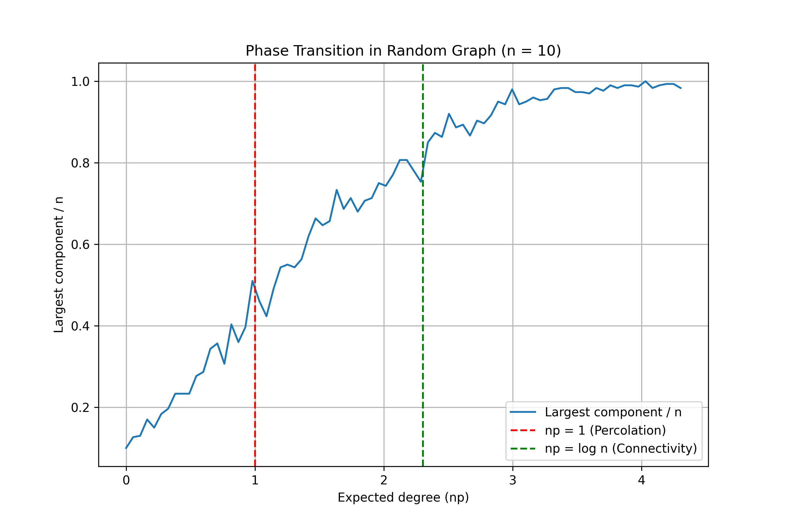
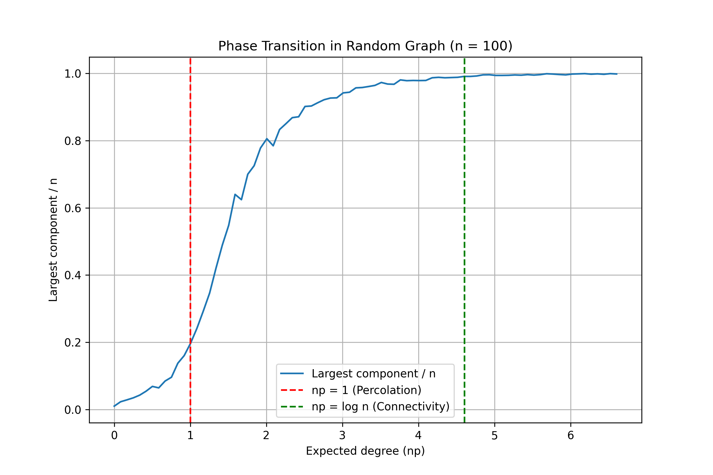
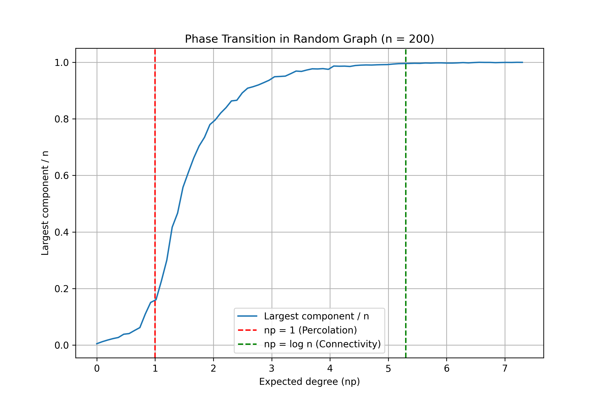
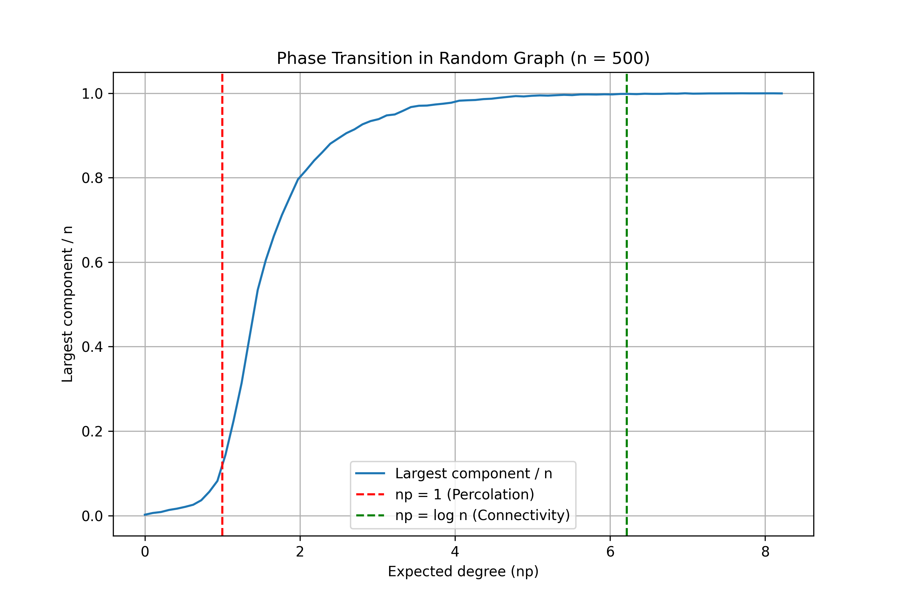

# PhaseTransitionGraphs

This project experimentally studies **connectivity phase transitions in Erdős–Rényi random graphs** using
graph traversal algorithms (DFS/BFS) and probabilistic analysis.

---

## 📌 Objective

To understand and validate:
- The emergence of a **giant connected component**
- The critical threshold at **p = 1/n**
- The role of **Chernoff bounds** in explaining concentration
- Finite-size effects in random graphs

---

## 📘 Background

In the Erdős–Rényi model G(n, p):
- Each edge appears independently with probability p
- When p = c/n:
  - If c < 1 → all components are small
  - If c > 1 → a giant component emerges
- Full connectivity occurs near p ≈ (log n)/n

---

## 🧪 Experiments

We perform three types of experiments:

### 1. Phase Transition Visualization (`expt.py`)
- Generates G(n,p) graphs
- Computes largest connected component
- Plots size vs expected degree (np)
- Values tested: n = 10, 100, 200, 500

### 2. Subcritical Regime Validation (`plot.cpp`)
- Uses p = 8/(9n) < 1/n
- Confirms largest component remains small
- Outputs results to a text file

### 3. With-High-Probability Experiment (`randomgen.cpp`)
- Uses p = (1 + ε)/n
- Demonstrates linear-sized component with high probability
- Reduced graph size for computational feasibility

---

## 📊 Results

## 📈 Experimental Results

The following plots show the normalized size of the largest connected component  
as a function of the expected degree \( np \) for different graph sizes.

---

### 🔹 n = 10 (Very small graph)



- Strong finite-size effects
- No sharp phase transition
- High randomness dominates behavior

---

### 🔹 n = 100



- Transition near \( np \approx 1 \) becomes visible
- Giant component starts to emerge

---

### 🔹 n = 200



- Clearer phase transition
- Reduced variance compared to n = 100

---

### 🔹 n = 500 (Closest to theory)



- Sharp emergence of the giant component near \( np = 1 \)
- Strong agreement with Erdős–Rényi theory
- Concentration effects clearly visible

---

## 🛠 How to Run

```bash
# Python experiment
python expt.py

# C++ experiments
g++ plot.cpp -o plot
./plot

g++ randomgen.cpp -o randomgen
./randomgen
